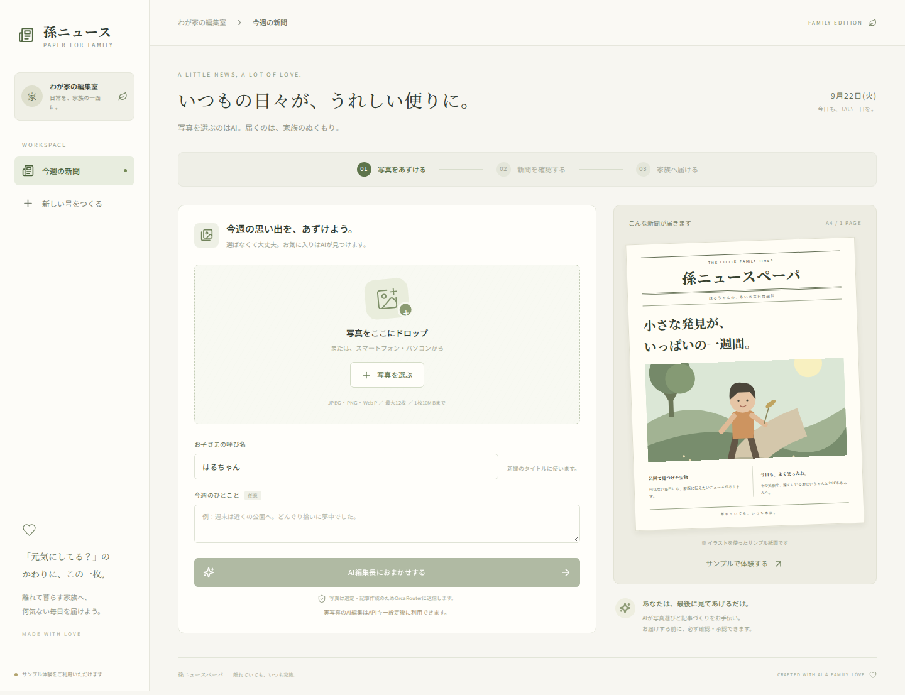

# 孫ニュースペーパ

写真をまとめてあずけると、AI編集長が写真を選び、日本語のA4新聞に編集します。親が確認・承認してからPDFを印刷し、祖父母への郵送を体験できます。



[生成したサンプルA4新聞PDF](docs/assets/sample-newspaper.pdf)

開発記事: [写真選びをAI編集長に任せる。「孫ニュースペーパ」をOrcaRouter × Spec Kitで作った](https://qiita.com/t-ry/items/5fde876e1a0c8c08cf40)

## ハッカソンMVPの起動

Node.js 20.19以降が必要です。

```bash
npm ci
cp .env.example .env
PLAYWRIGHT_BROWSERS_PATH=.cache/ms-playwright npx playwright install chromium
npm run dev
```

http://127.0.0.1:3000 を開きます。LinuxでChromiumの共有ライブラリが不足する場合は、`npx playwright install-deps chromium`で導入してください。

`.env`に`ORCAROUTER_API_KEY`を設定すると実写真のAI編集が使えます。キー未設定でも「サンプルで体験する」からPDFと模擬注文を試せます。`.env`の変更後はサーバーを再起動してください。

画像対応モデルの呼び出しにはOrcaRouterワークスペースの利用可能なクレジットが必要です。設定後は、個人写真を送信せず同梱イラストで疎通確認できます。

```bash
npm run verify:orcarouter
```

### 実装済みの機能

- JPEG / PNG / WebPを最大12枚まとめて追加（1枚10MB以内）。ブラウザで最大1600pxに縮小して再エンコード。
- **OrcaRouter API**へ画像を送信し、最大3枚の選定・選定理由・日本語記事を生成。
- 記事編集、掲載写真の差し替え、記事削除、紙面プレビュー。
- 親の承認後、日本語フォントを埋め込んだ**A4縦1ページPDF**をダウンロード。PDFを開いて印刷可能。
- 承認した新聞の**模擬印刷・郵送注文API**。未承認注文の拒否と重複防止。

**郵送はデモです。実際の印刷・郵送・請求は発生しません。** サンプル生成は固定文章と同梱イラストを使い、AI生成とは画面で区別しています。実AI呼び出しに失敗してもサンプルへ自動切替しません。

### OrcaRouterの利用箇所

`server/orca.js`から`https://api.orcarouter.ai/v1/chat/completions`へBearer認証付きでリクエストします。`image_url`に写真を渡し、JSONで記事を受け取ってサーバーで検証します。初期モデルは`openai/gpt-4o-mini`。`ORCAROUTER_MODEL`で画像入力・JSON出力対応モデルに変更できます。

### 開発・検証

```bash
npm test             # API・承認・注文・OrcaRouterリクエスト形式
npm run build        # 本番ビルド
npm run test:e2e     # 開発サーバー起動中に実行。ブラウザ・PDF・模擬注文
npm run verify:orcarouter # 実APIを同梱デモ画像で検証（キーとクレジットが必要）
npm start           # ビルド後の本番モード起動
```

技術構成: React / Vite / Express / Zod / Playwright Chromium。画面とPDFは`shared/newspaper.js`の同じテンプレートから描画します。

### データと現在の制約

- 写真と記事・宛先はサーバーメモリでセッション別に保持し、再起動で消えます。2時間利用のないセッションは次のAPIアクセス時に削除されます。
- 写真の実AI編集ではOrcaRouterと利用モデルの提供元へ画像が送信されます。
- 初期設定はローカル利用です。公開サービス用のユーザー認証、永続保存、課金、実郵送APIは未実装。
- 動画・撮影期間抽出・端末写真の自動収集・定期発行・編集嗜好学習は今後の拡張です。

仕様・計画・タスク: [specs/001-mago-newspaper](specs/001-mago-newspaper/)。
検証結果: [docs/verification.md](docs/verification.md)。Qiita記事: https://qiita.com/t-ry/items/5fde876e1a0c8c08cf40

---

## プロダクト構想（原案）

以下は当初の構想です。実装済み範囲は上の「ハッカソンMVP」を参照してください。原文は[docs/product-vision.md](docs/product-vision.md)にも保存しています。

# 孫ニュース（仮称）

> **撮るだけで、届く。**  
> スマホにたまった今週の孫の写真・動画をAIが自動で選び、ニュースとして編集し、祖父母へ届けるAIエージェント。

## 1. 概要

「孫ニュース」は、親が普段どおり子どもの写真や動画を撮るだけで、AIエージェントがその週の出来事を自動で抽出・編集し、祖父母向けのニュースを生成するサービスです。

親が毎回写真を選んだり、文章を書いたり、祖父母へ送ったりする必要はありません。

AIが以下を自律的に実行します。

1. 今週撮影された写真・動画を確認
2. 孫が写っている素材を抽出
3. 重複・ブレ・類似素材を除外
4. 出来事ごとにグルーピング
5. ニュース価値の高い出来事を選定
6. 写真・動画のベストショットを選定
7. ニュース記事を生成
8. 紙面を自動レイアウト
9. 親へ最終確認を依頼
10. 承認後、デジタル配信または紙媒体で祖父母へ配送

---

## 2. 解決したい課題

### 親側

親は日常的に子どもの写真・動画を大量に撮影している一方で、

- 祖父母に送る写真を選ぶ
- 写真に説明を付ける
- 定期的に送る
- 過去の写真を整理する

といった作業は継続的な負担になります。

そのため、写真はスマートフォンに大量に残っているにもかかわらず、祖父母には十分共有されないケースがあります。

### 祖父母側

祖父母は孫の成長を知りたい一方で、

- 写真共有アプリを日常的に使わない
- スマートフォン操作が得意とは限らない
- 家族へ「写真を送って」と頻繁に頼みにくい
- 写真だけ送られても出来事の背景が分からない

といった課題があります。

### 本サービスの考え方

親に新しい作業を増やすのではなく、

> **既に行っている「写真・動画を撮る」という行動から、AIが自動的に価値を生み出す。**

ことを目指します。

---

## 3. コンセプト

### Human

人間が行うことは原則として以下だけです。

- 子どもの写真・動画を撮る
- AIが作成したニュースを最終確認する
- 必要に応じて修正・削除する

### AI Agent

AIエージェントが担当する業務は以下です。

- 写真・動画収集
- 写真選定
- 動画からのベストフレーム抽出
- イベント推定
- ニュース価値判定
- 記事執筆
- 紙面編集
- 配信準備
- ユーザー確認
- 配送実行
- ユーザーの編集傾向の学習

---

## 4. 想定ユーザー

### Primary User

子育て中の親

### Recipient

離れて暮らす祖父母

### 将来的な対象

- 曽祖父母
- 親戚
- 離れて暮らす家族

---

## 5. MVP

ハッカソンでは以下をMVPとします。

### 入力

一定期間内に撮影された写真・動画群

例:

```text
2026-09-14 ～ 2026-09-20
```

### AI処理

```text
写真・動画取得
    ↓
撮影日時で今週分を抽出
    ↓
孫が写っている素材を抽出
    ↓
類似写真・失敗写真を除外
    ↓
出来事単位にクラスタリング
    ↓
ニュース候補を選定
    ↓
代表写真を選定
    ↓
記事生成
    ↓
紙面レイアウト
    ↓
PDF生成
```

### 出力

A4サイズの「孫ニュース」

例:

```text
○○ちゃんニュース
2026年9月 第4週号

────────────────

今週のトップニュース
「はじめて補助輪なしで自転車に乗れました！」

[写真]

9月20日、公園で自転車の練習をしました。
今週のベストショットです。

────────────────

今週のおでかけ
「動物園へ行きました」

[写真]

────────────────

今週の一枚

[写真]
```

### 配信

MVPでは以下のいずれかを実装します。

- PDFダウンロード
- メール送信
- 印刷・郵送API連携

---

## 6. MVPでやらないこと

初期MVPでは以下は対象外とします。

- 高度な動画自動編集
- BGM付きムービー生成
- 完全自動配送
- 複数家族への同時配送
- 課金
- SNS投稿
- 高度な家族関係推定
- 子どもの感情・性格の推定
- 医療・発達に関する推定

---

## 7. AIエージェントの処理

### Step 1. Collect

対象期間内の写真・動画を取得する。

```text
Photo Source
    ↓
Media Collector
```

### Step 2. Filter

以下を除外する。

- ブレ
- 真っ暗
- 極端な露出
- 同一シーンの大量連写
- 孫が写っていない素材

### Step 3. Understand

画像・動画をマルチモーダルAIで解析する。

取得したい情報の例:

```json
{
  "capturedAt": "2026-09-20T14:12:00+09:00",
  "people": ["child"],
  "scene": "park",
  "activity": "riding bicycle",
  "objects": ["bicycle", "helmet"],
  "qualityScore": 0.91
}
```

### Step 4. Cluster

同一イベントと思われる素材をまとめる。

判断材料:

- 撮影時間
- GPS
- 被写体
- 背景
- 行動
- 類似度

例:

```text
09/20 14:00-15:20
公園
自転車
↓
「公園で自転車練習」という1イベント
```

### Step 5. Select

ニュース価値を評価する。

例:

```text
ニュース価値 =
    新規性
  + 写真品質
  + 出来事のまとまり
  + 子どもの活動量
  + 過去記事との重複回避
```

MVPではAIによる定性的判定でも可。

### Step 6. Write

出来事ごとにニュース記事を生成する。

#### 重要

AIは画像から確認できない事実を創作しない。

NG:

```text
「初めて自転車に乗れました」
```

画像だけでは「初めて」かどうか判断できない場合。

OK:

```text
「公園で自転車の練習をしました」
```

追加情報が必要な場合は、

```text
この出来事について一言追加しますか？
```

と親へ確認する。

### Step 7. Layout

以下を自動生成する。

- 見出し
- 写真配置
- キャプション
- 本文
- 発行日
- 号数

### Step 8. Review

親へプレビューを表示する。

親ができる操作:

- 承認
- 写真削除
- 写真差し替え
- 記事修正
- 記事削除

### Step 9. Deliver

承認後に配送する。

```text
Digital
├─ Email
├─ LINE（将来）
└─ Web

Physical
└─ Print Delivery API
    ├─ 印刷
    ├─ 封入
    └─ 郵送
```

---

## 8. Agent Loop

孫ニュースは単発の生成AIではなく、継続的に動作するAIエージェントとして設計します。

```text
Observe
今週の写真・動画を確認
        ↓
Understand
出来事を理解
        ↓
Plan
紙面構成を決定
        ↓
Act
記事・紙面を生成
        ↓
Human Approval
親が確認
        ↓
Act
祖父母へ配送
        ↓
Learn
修正内容を次回の編集方針へ反映
        ↓
翌週へ
```

---

## 9. 学習する編集方針

将来的には家族ごとの好みを学習します。

例:

```text
・食事中の写真はあまり採用しない
・スポーツ写真を優先
・顔が大きく写っている写真を優先
・祖父母と一緒に写った写真を優先
・同じ公園の記事を連続掲載しない
```

AIエージェントは過去の

- 承認
- 削除
- 差し替え
- テキスト修正

を編集フィードバックとして利用します。

---

## 10. 想定画面

### 10.1 Home

```text
今週の孫ニュース

9/14 - 9/20

写真      84枚
動画      12本
ニュース   3件

[ 今週号を見る ]
```

### 10.2 Agent Processing

```text
AI編集長が今週号を作っています

✓ 96件の写真・動画を確認
✓ 5件の出来事を発見
✓ 8枚の写真を選定
✓ 3件の記事を作成
○ 紙面を編集中
```

### 10.3 Preview

新聞プレビューを表示。

```text
[編集する]

[祖父母へ送る]
```

### 10.4 Delivery

```text
配送方法

○ 紙で郵送
○ メール
○ PDF

配送先
山田 太郎・花子

[発送する]
```

---

## 11. システム構成案

現時点では技術スタック未確定のため、以下は暫定案です。

```text
Smartphone / Photo Source
        │
        ▼
Frontend
Next.js / TypeScript
        │
        ▼
Backend API
Python / FastAPI
        │
        ├──────────────┐
        ▼              ▼
Media Storage       Database
Object Storage      PostgreSQL
        │
        ▼
AI Agent
Python
        │
        ├─ Image/Video Analysis
        ├─ Event Clustering
        ├─ Photo Selection
        ├─ Article Generation
        └─ Layout Planning
        │
        ▼
PDF Generator
        │
        ├─ Digital Delivery
        │
        └─ Print Delivery API
```

---

## 12. 技術候補

### Frontend

- Next.js
- TypeScript

### Backend

- Python
- FastAPI

### Database

- PostgreSQL

### Media Storage

候補:

- AWS S3
- Google Cloud Storage
- Azure Blob Storage

### AI

必要な能力:

- Multimodal Vision
- LLM
- Embedding
- Image Similarity

利用モデルは未確定。

### Image Processing

候補:

- OpenCV
- Pillow

### Video Processing

候補:

- FFmpeg
- OpenCV

### PDF

候補:

- HTML + Playwright
- WeasyPrint
- ReportLab

### Physical Delivery

候補:

- 日本郵便 Webレター
- ネクスウェイ e-オンデマンド便
- Cloudprinter

本番サービスではAPI利用条件・料金・個人情報取扱いを確認する。

---

## 13. データモデル案

### User

```json
{
  "id": "user_001",
  "name": "parent"
}
```

### Child

```json
{
  "id": "child_001",
  "displayName": "○○ちゃん"
}
```

### Recipient

```json
{
  "id": "recipient_001",
  "relation": "grandparent",
  "deliveryMethod": "print"
}
```

### Media

```json
{
  "id": "media_001",
  "type": "photo",
  "capturedAt": "2026-09-20T14:12:00+09:00",
  "storageUrl": "...",
  "eventId": "event_001"
}
```

### Event

```json
{
  "id": "event_001",
  "title": "公園で自転車",
  "startAt": "2026-09-20T14:00:00+09:00",
  "mediaIds": [
    "media_001",
    "media_002"
  ]
}
```

### Article

```json
{
  "id": "article_001",
  "eventId": "event_001",
  "headline": "公園で自転車の練習！",
  "body": "公園で自転車の練習をしました。",
  "mediaIds": [
    "media_001"
  ]
}
```

### Issue

```json
{
  "id": "issue_001",
  "periodStart": "2026-09-14",
  "periodEnd": "2026-09-20",
  "status": "waiting_review",
  "articleIds": [
    "article_001"
  ]
}
```

---

## 14. プライバシー / セキュリティ

本サービスでは子どもの写真・動画を取り扱うため、プライバシーを最重要要件とします。

### 原則

- 家族の明示的な許可なくデータを外部公開しない
- AI学習への二次利用を前提としない
- 配送対象を家族が明示的に指定する
- 不要な顔認識・人物特定を行わない
- 元写真を必要以上に保持しない
- APIキーや認証情報を安全に管理する

### AI処理

モデルへ送信するデータ範囲を最小化する。

可能であれば、

```text
Local Preprocessing
        ↓
必要素材のみ
        ↓
AI API
```

とする。

---

## 15. ハッカソンデモ

### Demo Scenario

親が1週間で

```text
写真: 80枚
動画: 10本
```

を撮影済み。

親は何も整理していない。

↓

孫ニュースAgentを起動。

↓

AIが

```text
3つの出来事
8枚の代表写真
```

を抽出。

↓

新聞を自動生成。

↓

親がプレビュー。

↓

「祖父母へ送る」

↓

印刷・配送処理。

### Demo Message

> 親は写真を撮っただけです。

> 写真を選んでいません。

> 記事を書いていません。

> レイアウトしていません。

> AIエージェントが一週間の出来事を編集し、
> 孫ニュースとして祖父母へ届けました。

---

## 16. プロダクトメッセージ

### Main

> **撮るだけで、届く。**

### Sub

> スマホに眠っている孫の一週間を、
> AI編集長がニュースにして届けます。

---

## 17. 今後の拡張

- 自動定期発行
- 家族カレンダー連携
- 動画ハイライト
- LINE配信
- 祖父母からの返信
- 祖父母のコメントを次号へ掲載
- 家族年表
- 年間まとめ号
- 誕生日特別号
- 成長アルバム
- 複数祖父母への配送
- 家族ごとの編集方針学習
- 「ニュース価値」のパーソナライズ

---

## 18. 未決定事項

開発開始前に以下を決める必要があります。

### Photo Source

どこから写真・動画を取得するか。

候補:

- スマホから手動アップロード
- Google Photos
- iCloud Photos
- 専用アプリから端末写真へアクセス

### Platform

- Webアプリ
- iOS / Androidアプリ
- PWA

### AI Provider

- OpenAI
- Google Gemini
- AWS Bedrock
- その他

### Cloud

- AWS
- GCP
- Azure
- その他

### Print Provider

- 日本郵便
- ネクスウェイ
- Cloudprinter
- ハッカソンではモック

### Issue Frequency

候補:

- 毎週
- 隔週
- 毎月
- ユーザー指定

---

## 19. 開発フェーズ案

### Phase 1

```text
写真アップロード
↓
AI写真選定
↓
記事生成
↓
Webプレビュー
```

### Phase 2

```text
イベントクラスタリング
↓
紙面自動生成
↓
PDF
```

### Phase 3

```text
ユーザー承認
↓
印刷・配送API
```

### Phase 4

```text
定期実行
↓
編集嗜好学習
↓
完全なAgent Loop
```

---

## 20. Status

**Hackathon Prototype / Planning**

現在はMVP仕様策定フェーズです。
